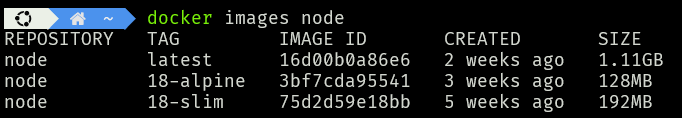
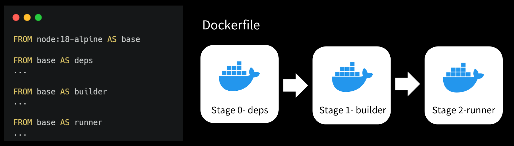

As I've been writing Dockerfile for Next.js, I've noticed that the build size is very big.<br/>Today, I want to share some strategies to optimize Dockerfile.

## 1.   Choosing the Right base Image
The **node:18-alpine** image is small and efficient, which helps reduce the overall size of  Docker image.
If you want to use a different version, you could replace the 18 with a 16 or 20!
<br/>



## 2.   Use multi-stage builds
### Introduce
Docker introduced the Multi-Stage Builds feature in version 17.05. Before version 17.05, achieving multi-stage builds  would require multiple Dockerfiles. If the build environment was complex, maintaining multiple Dockerfiles might be necessary. However, Multi-Stage Builds can address the issue of needing to maintain multiple Dockerfiles.

### How to use it
To utilize multi-stage builds, we need to use multiple **FROM** statements in a single Dockerfile. Each **FROM** instruction can use a different base image and starts a new stage of the build.

## 3.   Use Standalone Application in Next.js
<!-- we can see [Next.js Doc/api-reference/next-config-js/output](https://nextjs.org/docs/app/api-reference/next-config-js/output) -->
### Automatically Copying Traced Files
Next.js can automatically create a standalone folder that copies only the necessary files for a production deployment including select files in node_modules.
To leverage this automatic copying you can enable it in your next.config.js:
```typescript
// next.config.js
module.exports = {
  output: 'standalone',
}
```
This will create a folder at **.next/standalone** which can then be deployed on its own without installing node_modules.
<br/>
Additionally, a minimal server.js file is also output which can be used instead of next start. This minimal server does not copy the public or .next/static folders by default as these should ideally be handled by a CDN instead, although these folders can be copied to the standalone/public and standalone/.next/static folders manually, after which server.js file will serve these automatically.